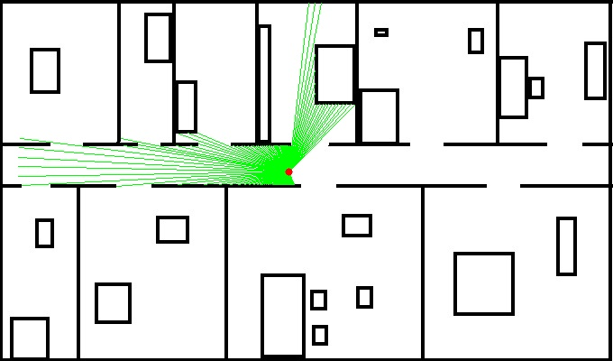

# endpoint-model-for-laser-range-measurements
## Cognitive Robotics:

## Part 1:
Given is a 2D grid-map and a robot pose (x, y, θ):

We find the map in the directory. Assuming that every pixel has a size of 4cm x 4cm.

I Generated laser-range measurements for an opening angle of 250° (125° left and right of the heading direction), every 2° by ray casting.
Using a maximum measurement range of 12m.

results at: x = 320, y = 190, theta = 190:

## Part 2:
Implementing the endpoint model for laser-range measurements.

Testing the model by computing the likelihood of the generated laser scan for a 3D-grid of poses (x, y, θ).

Likelihood at sigma = 1.0:

Likelihood at sigma = 5.0:

Likelihood at sigma = 10.0:

Likelihood at sigma = 20.0:

For each 2D-cell of the x,y-grid of the map above, visualize the highest likelihood of all orientations θ as gray value.

endpoint model map at:

### sigma = 1.0

● at laser-range = 0.2

● at laser-range = 0.5

● at laser-range = 1.0

● at laser-range = 2.0

● at laser-range = 3.0 ⇒ it’s a white image

### sigma = 5.0

● at laser-range = 0.2

● at laser-range = 0.5

● at laser-range = 1.0

● at laser-range = 2.0

● at laser-range = 3.0 ⇒ it’s a white image

### sigma = 10.0

● at laser-range = 0.2

● at laser-range = 0.5

● at laser-range = 1.0

● at laser-range = 2.0

● at laser-range = 3.0 ⇒ it’s a white image

### sigma = 20.0

● at laser-range = 0.2

● at laser-range = 0.5

● at laser-range = 1.0

● at laser-range = 2.0

● at laser-range = 3.0 ⇒ it’s a white image

